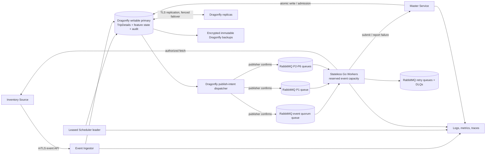

# Technical Design: Proactive TripDetails Refresh

**Status:** Revised for review — Dragonfly-only TripDetails and feature state  
**Scope:** Design only; no implementation code.  
**Requirements source:** [requirements.md](./requirements.md)

## Overview

This revision makes Dragonfly the **only platform that maintains TripDetails and all feature state**. No relational or Cassandra datastore is part of this design. RabbitMQ remains the `Durable_Message_Broker` required by the requirements; it holds delivery, retry, and DLQ messages, not the authoritative TripDetails or feature-control records.

The system maintains eligible route/departure pairs in the inclusive configured window (default today through today + 40 calendar days). Authenticated inventory events and scheduled decisions create Dragonfly-durable trigger state, coalesce by normalized `Refresh_Key`, and publish durable RabbitMQ work. Stateless Workers fetch source data and submit only to Master_Service. Master_Service is the only TripDetails writer and uses a Dragonfly atomic primitive to ensure that only a strictly greater `Freshness_Version` changes a key.

### Goals and hard guardrails

- Master_Service is the only principal with write permission for `TripDetails` keys. Workers have no Dragonfly write credentials for them.
- Accepted triggers, retry state, failure reports, correlation audit, scheduled-cycle state, coalescing state, and TripDetails are persisted in Dragonfly; process memory is never correctness state.
- A single Dragonfly atomic script/function is the per-`Refresh_Key` compare-and-write authority. Equal versions return `DUPLICATE`; lower versions return `STALE`; neither mutates TripDetails.
- RabbitMQ manual acknowledgement, redelivery, retry queues, and DLQs provide at-least-once work delivery. Duplicate delivery is intentional-safe because Master ordering is idempotent.
- Dragonfly availability, durability, and recovery are production prerequisites. If the required durability mode, writable-primary fencing, replica health, backup currency, or restore evidence is absent, the affected service remains unready and accepts no new work.
- All calendar logic uses one configured time zone and injected clock; all ordering and audit times use UTC.

### Research basis and explicit operating consequence

Dragonfly documents primary–replica replication, role inspection, replica promotion, replication-lag observability, and TLS replication ([Replication](https://www.dragonflydb.io/docs/managing-dragonfly/replication)). Its operator documents automatic primary endpoint updates in an HA deployment ([High availability](https://www.dragonflydb.io/docs/managing-dragonfly/high-availability)), while snapshots on persistent volumes support restart/restore but are explicitly not a substitute for replication ([Snapshots through PVC](https://www.dragonflydb.io/docs/managing-dragonfly/operator/snapshot-pvc)). Content was rephrased for compliance with licensing restrictions.

Replication and snapshots do **not**, by themselves, establish zero data loss during a primary failure. Before production acceptance, the platform owner must certify the deployed Dragonfly version and configuration’s write-durability acknowledgement, AOF/fsync behavior, replica-acknowledgement behavior if used, and resulting RPO. The feature’s required “no silently lost accepted request” outcome is allowed only when `SUCCESS` is returned after that certified durable acknowledgement. If the selected Dragonfly release/configuration cannot provide the required bound, the service must remain unready; silently treating asynchronous replication or periodic snapshots as equivalent is prohibited. The recorded RPO/RTO and approved exception, if any, are release gates rather than application fallback behavior.

## Architecture



Dragonfly has one writable primary endpoint. Event_Ingestor, Scheduler, publisher, and Master_Service write only through that endpoint. Replicas are not used for writes or correctness decisions. The deployment must fence a demoted or partitioned primary at the network/routing layer before promotion; during uncertain role/epoch or excess replication lag, all state-changing clients fail closed. A Kubernetes operator or equivalent routing layer may perform failover, but it is not a feature-state store.

### Work topology and component boundaries

RabbitMQ uses one event quorum queue and P1–P6 scheduled quorum queues, each with durable retry routes and durable DLQs. Separate queues plus reserved Worker slots keep event-driven work consumable during scheduled backlog. Weighted scheduled consumption gives P1 precedence while allocating age-triggered service to lower priorities.

| Component | Responsibilities | Durable behavior |
|---|---|---|
| Event_Ingestor | Authenticate/validate event identity, route/date, source time, and correlation; audit; evaluate window; request coalescing | One Dragonfly atomic operation records accepted audit and in-window trigger/publish intent before `SUCCESS`. Out-of-window events are audit-only. |
| Scheduler | Acquire fenced lease; enumerate active eligible pairs; tier and prioritise; retain/retry cycles | Dragonfly cycle, candidate, and publish-intent keys hold both non-empty and empty decisions and outcome counts. |
| Publisher | Select pending intents, publish with message ID/correlation, record confirms | Confirmation atomically marks the intent published. Unknown confirmation stays `PUBLISH_UNCERTAIN` for reconciliation; re-send is permitted only with identical identity and audit, making broker duplication harmless rather than hidden. |
| Worker | Consume, claim, source fetch, build, submit, retry/report/DLQ/ack | No local correctness state; crash leaves RabbitMQ message unacknowledged for redelivery. |
| Master_Service | Authenticate, validate, globally admit, atomically order/write TripDetails, accept failure records | Only writer of TripDetails and associated version/audit keys. |
| Dragonfly | Authoritative TripDetails, audit, cycles, triggers, claims, publish intents, failure reports, admission counters | AOF/snapshot/replication/backup and role-health gates are mandatory. |

### Master_Service versus Worker responsibilities

| Concern | Master_Service | Worker |
|---|---|---|
| TripDetails | Authenticates/validates then performs atomic greater-version write | Constructs candidate payload and uses only `Refresh_Submission_API` |
| Dragonfly access | Writes protected TripDetails, audit, admission, and failure-report namespaces | May read its claim through restricted interface; no TripDetails write authority |
| Source data | Does not fetch refresh source data | Retrieves approved secret reference, fetches authorized source data, preserves source metadata |
| Delivery | Returns `ACCEPTED`, `DUPLICATE`, `STALE`, retryable, or client/security result | Manually consumes, retries, reports permanent failure, publishes DLQ, and acknowledges only terminal success |
| Load control | Uses Dragonfly atomic counters/leases as global admission policy | Obeys retry guidance, reserved pools, and in-flight limits |

## Components and Interfaces

### Scheduling, coalescing, and publication

The Scheduler uses a Dragonfly lease record with a monotonically increasing fencing value. Failed renewal immediately stops it publishing. Cycle creation atomically records cycle identity, start time, candidate-set status (including explicit empty), counts, and candidate cursor. Every active route and eligible departure date is evaluated from one injected-clock snapshot. Candidates already recorded remain eligible even if a route later becomes inactive. Dependency/internal/timeout failure records the failed cycle and retains its cursor for recovery.

A `Refresh_Key` coalescing script creates or merges a durable state record. It retains event trigger over scheduled trigger, greatest comparable freshness context, highest urgency, primary/contributing correlation IDs, and one current execution claim. If metadata cannot be safely compared or preserved, the operation rejects coalescing and creates individually auditable intents. If command outcome is ambiguous, publication is blocked for that key and the trigger remains durable as `COALESCE_UNCERTAIN`; a reconciler replays the same atomic operation after primary health is re-established. Lease expiry permits liveness recovery only; it never proves a prior Worker did not execute.

A publish intent is Dragonfly feature state. It is created with the trigger in the same atomic script, then dispatched to RabbitMQ with its immutable `request_id` and correlation ID. Confirmed delivery changes it to `PUBLISHED`. An unknown confirmation is never discarded: the publisher records it, queries/reconciles where supported, and only then reissues the same immutable message identity. The resulting at-least-once broker duplicate is handled by the execution claim and Master idempotency.

### API contracts

All protected APIs use TLS, validated service identity, least privilege, request-size limits, schema versions, additive backward compatibility, idempotency identity, and redaction. Authentication, authorization, malformed/oversized fields, invalid identity/date/version, unsupported schema, and secret-bearing payloads are rejected before source retrieval or TripDetails write.

| API | Required content | Terminal/retry behavior |
|---|---|---|
| `InventoryChange` | Route, departure date, immutable event identity, source event time, correlation ID, schema version | Valid in-window acceptance returns `SUCCESS` only after Dragonfly durable audit/intent acknowledgement. Valid out-of-window is audited without work. Producer safely retries uncertain calls by event identity. |
| `RefreshSubmission` | Route, date, TripDetails, `Freshness_Version`, source observation time, fetch time, correlation ID, schema version | `ACCEPTED` only for a greater atomic version write; equal is `DUPLICATE`, lower is `STALE`—both terminal/idempotent. Rate/dependency outcomes are retryable. |
| `FailureReporting` | Refresh_Key, original correlation, failure category, retry count, trigger/queue, redacted actionable detail | Idempotent on original correlation plus failure identity. Its Dragonfly record is preserved for retry before terminal handling. |
| `GET TripDetails` | Authorized normalized route/date | Direct Dragonfly key lookup returns latest payload/version and fresh/stale/pending/outside-window metadata; it never fetches source data. |

### Observability and audit

Every Scheduler/Event_Ingestor, RabbitMQ envelope, Worker source call, Master API call, Dragonfly state transition, retry, and DLQ record carries the same correlation ID and distributed trace context. Dragonfly audit entries record accepted, coalesced, published, consumed, retried, submitted, persisted, stale, duplicate, rate-limited, failed, dead-lettered, and security outcomes. The correlation key and time-bucketed audit stream must return the complete path and terminal outcome within 30 seconds under normal operation; if that bound cannot be met, the query returns a documented rejection rather than incomplete success.

Metrics include eligible candidates, event/scheduled trigger counts, coalescing ratio, queue depth and oldest age, in-flight work, processing/source/API latency, success/stale/retry/DLQ rates, downstream rejections, Dragonfly command/persistence/backup failures, primary role, replication lag, restore age, and audit query latency. Telemetry failure cannot block correct work. Credential, token, and configured sensitive values are redacted before any log, trace, metric label, or Dragonfly audit write.

### Worker acknowledgement, retry, and DLQ

1. Worker manually consumes event or scheduled work, validates the envelope, and obtains a fenced per-key claim.
2. It fetches authorized Inventory_Source data, builds TripDetails, and submits source-derived version, observation UTC time, fetch UTC time, and correlation ID.
3. `ACCEPTED`, `DUPLICATE`, and `STALE` are terminal success and make broker acknowledgement eligible. `RATE_LIMITED` and transient failures use bounded exponential backoff with jitter and no concurrency increase.
4. A nonterminal failure is classified exactly once. A permanent failure first creates exactly one idempotent FailureReporting record using the original correlation. If reporting is unavailable, that record remains Dragonfly-durable and is retried.
5. An exhausted transient or reported permanent failure is publisher-confirmed to the contextual RabbitMQ DLQ, then the original is acknowledged. Failed DLQ publication leaves the original unacknowledged.

Successful acknowledgement is retried indefinitely while the AMQP channel is live. A channel/process loss before acknowledgement is treated as logically complete; the Worker does not intentionally republish and allows broker redelivery. Master version ordering makes that redelivery terminal-safe. Non-success work is never acknowledged.

## Data Models

### Namespaces, direct keys, and expiration

Dragonfly key names are versioned, encoded, and length-bounded. `rk` is a canonical URL-safe encoding of normalized route scope and ISO departure date; no user-controlled value is concatenated unescaped. There are no relational tables, secondary indexes, or partitions. Direct lookup keys and bounded sorted sets/streams provide the required access patterns.

| Namespace | Value/invariant | Expiration and recovery |
|---|---|---|
| `td:v1:{rk}` | Complete `TripDetailsCurrent`: payload, `FreshnessVersion`, source/fetch/accepted UTC times, correlation, schema, audit status | `EXPIREAT` equals configured retained-data expiry. No short cache TTL may evict current in-window data. Expiry is applied only by Master’s atomic write script. |
| `trg:v1:{event-id}` / `coal:v1:{rk}` | Accepted trigger audit and merged coalescing state: trigger class, urgency, comparable version, contributing correlations, status, claim/fence | Coalescing/claim lease has a short explicit TTL. Trigger audit uses configured audit retention, never claim TTL. |
| `cycle:v1:{id}`, `candidate:v1:{id}:{rk}`, `cycle-pending:v1` | Cycle timestamps/counts/status, retained candidate generation and bounded recovery cursor | Expire only after configured cycle-audit retention and successful terminal accounting. |
| `intent:v1:{request-id}`, `intent-pending:v1` | Immutable RabbitMQ envelope identity, route, state, confirm metadata, attempts | Retain until broker terminal outcome plus configured audit retention; reconciliation drains abandoned pending/uncertain entries. |
| `failure:v1:{correlation}:{identity}` | Redacted failure report and report-attempt state | No expiry before DLQ/report terminal status and configured audit retention. |
| `audit:v1:{correlation}` and time-bucketed audit stream | Correlation-path records for accepted/coalesced/published/consumed/retried/submitted/persisted/stale/duplicate/rate-limited/failed/DLQ outcomes | Retain at least configured query and compliance duration; bounded stream trimming occurs only after backup-retention proof. |
| `limit:v1:*`, `leader:v1:scheduler` | Admission counters and leader/claim fences | Short TTLs; loss fails closed or liveness-recovers only, never replaces durable records. |

`RefreshKey` is immutable and is the sole coalescing and TripDetails identity. `FreshnessVersion` is one configured total order: `scheme_id`, fixed-width sortable primary, and canonical deterministic tie-breaker. A monotonic Inventory_Source revision is preferred. Without one, readiness requires configured `(source_observation_time_utc, source_event_id)` ordering and accepted source clock-skew bound; future timestamps beyond that bound are rejected. Fetch time never participates in ordering.

### Atomic ordering and write primitive

Master_Service performs one Dragonfly atomic script/function against `td:v1:{rk}`. It validates the configured scheme and fixed-width ordering representation, reads the current version, compares it, and then:

- greater: writes the complete new TripDetails envelope, writes correlation/audit entry, updates expiration, and returns `ACCEPTED`;
- equal: appends duplicate audit outcome without changing the TripDetails envelope and returns `DUPLICATE`;
- lower: appends stale audit outcome without changing the TripDetails envelope and returns `STALE`.

The script executes on the writable primary and must include every affected key in its declared key set. It does not use read-then-write application logic, cross-primary writes, or best-effort background ordering. Concurrent Master instances therefore serialize competing writes for a `Refresh_Key` at the atomic primitive. This preserves the greatest stored version through concurrent requests and broker redeliveries.

```mermaid
sequenceDiagram
  participant W as Worker
  participant M as Master_Service
  participant D as Dragonfly writable primary
  W->>M: RefreshSubmission(key, details, version, metadata, correlation)
  M->>M: authenticate, authorize, validate, globally admit
  M->>D: atomic compare-and-write script for td:v1:{key}
  alt incoming version greater
    D-->>M: payload/version/audit written; ACCEPTED
    M-->>W: ACCEPTED
  else incoming version equal
    D-->>M: audit only; DUPLICATE
    M-->>W: DUPLICATE
  else incoming version lower
    D-->>M: audit only; STALE
    M-->>W: STALE
  end
  W->>W: make RabbitMQ acknowledgement eligible
```

### Durability, HA, backup, and restore prerequisites

1. **Persistence:** deploy the certified Dragonfly version with AOF enabled on durable encrypted volumes and with scheduled point-in-time snapshots. The selected fsync/acknowledgement policy, maximum acknowledged-write loss window, snapshot cadence, and disk headroom must be documented. A snapshot is recovery support, not the only durability mechanism.
2. **Replication and failover:** run a writable primary plus at least one replica across independent failure domains using TLS replication. Monitor `ROLE`, replica state, and lag. Route writers only to the primary service endpoint. Primary fencing and promotion authority must prevent a previous primary from accepting writes after it loses leadership. Role uncertainty, no healthy replica, lag beyond the certified RPO, or unavailable write durability makes Master/Event_Ingestor/Scheduler unready for new acceptance.
3. **Backup/restore:** export encrypted, immutable, access-controlled Dragonfly snapshots and AOF recovery material on the configured schedule, retain them at least through audit-retention requirements, and test restoration at least once per release and periodically in production. Backup copies are recovery artifacts, never a second online feature state.
4. **Recovery:** freeze writes; select the latest verified coherent snapshot plus AOF material; restore into a fenced replacement primary; verify version/audit key integrity and expiry behavior; attach/synchronize replicas; verify restore point/RPO; then unpause publisher and consumers. RabbitMQ redelivery plus pending-intent reconciliation reconstructs unfinished work. Master’s atomic version ordering prevents restored/replayed work from overwriting a greater retained version.
5. **Capacity:** reserve memory for current TripDetails, audit retention, cycles, intents, failure reports, scripts, snapshot overhead, and fragmentation. Eviction is disabled for authoritative namespaces. Any memory-pressure eviction, persistence error, failed backup, or retention-capacity breach is a readiness failure, not an allowed loss mechanism.

## Correctness Properties

*A property is a characteristic or behavior that should hold true across all valid executions of a system—essentially, a formal statement about what the system should do. Properties bridge human-readable specifications and machine-verifiable correctness guarantees.*

### Reflection on redundancy

The prework combines tier classification/matrix completeness into one property; event/scheduled merge, greatest version context, and urgency retention into one property; all greater/equal/lower concurrent submission rules into one atomic monotonic-version property; and terminal/nonterminal acknowledgement mapping into one property. Dragonfly persistence, replication/failover, backup/restore, RabbitMQ delivery, TLS, audit lookup, and capacity are infrastructure integration, recovery, smoke, or load tests, not universal in-memory properties.

### Property 1: Inclusive calendar eligibility
For all injected instants, configured time zones, positive windows, and departure dates, eligibility is true exactly for dates from the configured current date through its inclusive window end.

**Validates: Requirements 1.2, 1.5**

### Property 2: Inactive and ineligible routes create no candidate
For all inactive routes and route date sets with no eligible date, scheduled generation creates no Scheduled_Refresh.

**Validates: Requirements 1.3**

### Property 3: Candidate coverage survives later inactivity
For all active-route snapshots and eligible dates, one decision evaluates each pair once; later route inactivity does not remove its recorded candidate.

**Validates: Requirements 2.2**

### Property 4: Coalescing permits at most one active execution
For all trigger, claim, lease-expiry, and release interleavings for a Refresh_Key, Dragonfly coalescing admits at most one active claim.

**Validates: Requirements 2.5, 6.2**

### Property 5: Event validation and window outcomes are side-effect safe
For all notifications, valid in-window input creates/updates work, valid out-of-window input creates audit only, and malformed/unknown identity/date input creates no executable work.

**Validates: Requirements 3.1, 3.2, 3.3**

### Property 6: Coalescing preserves dominant metadata
For all comparable trigger collections for one Refresh_Key, merged state preserves an event trigger when present, greatest known Freshness_Version, and highest urgency/priority.

**Validates: Requirements 3.4, 4.7, 6.3**

### Property 7: Tier/matrix mapping is total and unique
For all valid thresholds, complete P1–P6 matrices, routes, and eligible dates, each route/date receives one tier and their pair receives exactly the configured priority.

**Validates: Requirements 4.1, 4.2, 4.3, 4.4, 4.5**

### Property 8: Refresh_Key canonicalization preserves identity
For all equivalent valid route/date representations normalization produces the same key; distinct canonical identities do not collide.

**Validates: Requirements 6.1**

### Property 9: Submission preserves source ordering context
For all valid source results, the Worker submission preserves Refresh_Key, Freshness_Version, source observation time, fetch time, and correlation ID.

**Validates: Requirements 8.1**

### Property 10: Dragonfly TripDetails state is monotonic by version
For all sequences and concurrent orderings of valid submissions for one Refresh_Key, the atomic primitive leaves the greatest version stored; greater is accepted, equal is duplicate without payload mutation, and lower is stale without payload mutation.

**Validates: Requirements 5.3, 8.2, 8.3, 8.4, 8.5, 10.4**

### Property 11: Submission outcomes determine acknowledgement
For all Worker states, only `ACCEPTED`, `DUPLICATE`, and `STALE` make acknowledgement eligible; every other result leaves the message unacknowledged.

**Validates: Requirements 5.6, 7.4, 7.5**

### Property 12: Admission and Worker concurrency respect limits
For all admission capacities, arrival sequences, Worker caps, and retry guidance, admitted work never exceeds capacity and retry does not exceed in-flight limits.

**Validates: Requirements 9.2, 9.3**

### Property 13: Scheduled publication respects its bound
For all candidate counts and configured batch/rate limits, a cycle publishes no more than the configured bound.

**Validates: Requirements 9.4**

### Property 14: Failure classification and retry delay are bounded
For all typed failures and retry configurations, each failure has exactly one class and generated exponential-jitter delays remain in bounds with no attempt beyond the limit.

**Validates: Requirements 12.1, 12.2**

### Property 15: Permanent failure reporting precedes terminal handling
For all permanent failures and temporary reporting unavailability, the original-correlation report is preserved and attempted before terminal DLQ handling.

**Validates: Requirements 5.5, 12.4, 12.5**

### Property 16: Replay preserves correlation identity
For all DLQ records, replay is accepted only when the original correlation ID is retained unchanged.

**Validates: Requirements 12.6**

### Property 17: Invalid protected input has no downstream effect
For all unauthenticated, unauthorized, oversized, malformed, unsupported-schema, invalid identity/date/version requests, the API returns a client/security error and does not retrieve source data or write TripDetails.

**Validates: Requirements 11.5, 14.5**

### Property 18: Observability redacts sensitive values
For all credential, token, and configured-sensitive input values, logs, traces, metrics, and Dragonfly audit details exclude the original value and use the configured redaction form.

**Validates: Requirements 13.6, 14.6**

## Architecture Decision Register

| ADR | Alternatives and selected decision | Rationale, consequence, and recovery |
|---|---|---|
| ADR-01 Work streams | One shared queue versus isolated event and P1–P6 scheduled queues. **Selected:** isolated queues. | Event capacity cannot be consumed by scheduled backlog. Cost is queue/policy monitoring; RabbitMQ quorum queues recover delivery. |
| ADR-02 Scheduled priority | Broker priority versus separate queues. **Selected:** P1–P6 queues with weighted fairness/age override. | Avoids prefetch priority ambiguity and exposes starvation. |
| ADR-03 Dragonfly-only state | Separate durable control data versus Dragonfly namespaced durable state. **Selected:** Dragonfly keys/streams for all TripDetails, audit, cycle, trigger, intent, claim, and failure state. | One state platform removes cross-store drift. AOF/snapshot/replica/backup/fencing prerequisites are mandatory; failure blocks acceptance rather than losing state. |
| ADR-04 Publication handoff | Direct broker publication alone versus Dragonfly publish intent plus RabbitMQ confirms. **Selected:** Dragonfly intent. | Atomic trigger/intent creation precedes send; unknown confirms reconcile/reissue identical identity and permit safe at-least-once duplicate delivery. |
| ADR-05 Coalescing/admission | Local process state, broker-only state, or Dragonfly atomic scripts. **Selected:** Dragonfly atomic scripts. | Local/broker-only choices cannot merge metadata and claims atomically. Role ambiguity fails closed; short leases provide liveness only. |
| ADR-06 Version ordering | Source revision versus timestamp/event-ID tuple. **Selected:** source revision when present; configured timestamp tuple fallback. | Revision resists replay/skew; fallback requires a skew bound and deterministic tie-breaker. |
| ADR-07 Durability and HA | Memory-only/snapshots-only/asynchronous replica versus certified AOF + snapshots + replicas + fencing + tested restore. **Selected:** the certified composite deployment. | No one mechanism is sufficient. If the certified RPO/RTO cannot meet requirements, readiness is denied; backup restore and RabbitMQ reconciliation recover unfinished work. |

Each ADR may record `decision_date`, `owner`, `reason`, `migration_impact`, `compatibility_assessment`, and `decision_changed` independently. Durable state is Dragonfly feature data and RabbitMQ delivery/DLQ messages; no relational or Cassandra persistence is used.

## Error Handling

| Scenario | Response and safe recovery |
|---|---|
| Invalid configuration, ordering fallback, insufficient Dragonfly durability/backup certification, or unhealthy writable-primary prerequisites | Startup/readiness failure before work acceptance. |
| Scheduler dependency failure | Record failed cycle/cursor in Dragonfly, retain empty/non-empty candidate state, retry after recovery. |
| Dragonfly role loss, fencing ambiguity, lag beyond bound, persistence error, memory pressure, or failed backup | Fail closed for acceptance/publication/write; alert. Recover primary/replicas or restore, validate, then reconcile intents and RabbitMQ work. |
| Dragonfly coalescing ambiguity/loss | Retain trigger as uncertain, publish nothing for its key, reconcile after healthy primary; eventual duplicate remains version-safe. |
| RabbitMQ publish/confirm failure | Retain Dragonfly publish intent; reconcile confirmed/uncertain state and use identical identity for permitted resend. |
| Worker crash before ack | RabbitMQ redelivery; execution claim/freshness ordering makes repeated work safe. |
| Source/Master timeout or rate limit | Bounded jitter retry through RabbitMQ durable retry routes; attempt exhaustion creates contextual DLQ. |
| Invalid source data or client/security rejection | Preserve one redacted failure report, then confirmed DLQ/terminal handling. |
| Equal/lower version | Return terminal duplicate/stale; leave TripDetails envelope intact; Worker acknowledges. |
| Failure report/DLQ unavailable | Preserve Dragonfly report/intent and leave original unacknowledged until safe terminal handoff. |
| Restore/failover | Fence old writer, restore/catch up, validate state and RPO, promote one primary, reconcile intents, then let broker redeliver. No stale restored result may overwrite a greater version. |
| Observability unavailable | Bound and count telemetry failure; Dragonfly audit and correct work continue; alert visibility degradation. |

## Testing Strategy

Future Go tests use `testing` and `pgregory.net/rapid` at an approved pinned version. There is one property test for each Property 1–18, at least 100 cases each, deterministic seed capture/shrinking, and tag `Feature: proactive-tripdetails-refresh, Property N: <title>`. Tests inject clocks and interfaces and never use live production infrastructure.

Example/unit and contract tests cover configuration defaults/errors, empty cycles, tier fallback, API schemas/statuses/deadlines/size/idempotency, source timestamp fallback, secret exclusion, and replay refusal. Dragonfly adapter tests use a disposable Dragonfly primary and validate key encoding, expiration, atomic scripts, ACL separation, no-eviction policy, concurrent greater/equal/lower submissions, claims, intent reconciliation, audit correlation lookup, and failure-report persistence.

Integration and recovery tests use disposable RabbitMQ quorum queues with a Dragonfly primary/replica topology on persistent storage. They verify publisher confirms, manual ack/redelivery, retry/DLQ routing, isolated event capacity, primary fencing, planned/unplanned promotion, lag/readiness failure, AOF/snapshot restore, backup integrity, restore point/RPO evidence, primary loss during trigger/intent/write, coalescing recovery, retained failed cycles, global admission, source/Master outages, and correlation traces. A restore test must prove pending intents and RabbitMQ redelivery reach accepted/idempotent/retry/DLQ states without a stale overwrite.

Load, race, leak, and fault tests establish normal-load throughput for 1/2/5/10 Workers, Dragonfly memory/disk/snapshot headroom, queue age, recovery RTO, audit lookup within 30 seconds, security/TLS/ACL behavior, and no secret leakage. Backup/restore, failover, and primary-fencing drills are release gates.

| Requirements | Primary coverage | Operational gate |
|---|---|---|
| 1–4 | Unit/property plus Scheduler integration | Clock/time-zone, matrix, and cycle dashboards |
| 5–8 | API/property plus Dragonfly atomic/concurrency integration | Master-only ACL and version/skew review |
| 9–10 | Limiter property, multi-worker/load/failover integration | Capacity, lag, and queue-age alerts |
| 11–12 | Contract, retry/DLQ, reporting, recovery integration | Authorized replay and incident runbook |
| 13–14 | Trace/audit/redaction/security integration | 30-second lookup, TLS, certificate, ACL audit |
| 15–16 | Lifecycle/readiness/ADR smoke and drills | Certified durability/RPO/RTO, backup/restore, architecture approval |

### Go implementation readiness

The implementation plan keeps domain rules (key normalization, eligibility, tier matrix, versions, merge, retry, classification) pure; application orchestration handles lifecycle; infrastructure adapters cover RabbitMQ, Dragonfly, source, secret management, HTTP APIs, metrics, and tracing. Interfaces provide deterministic clock and dependency behavior. Deployment validates configuration, dependencies, ACLs, durability certification, replicas, backup recency, memory/disk limits, request size, connection/prefetch/concurrency, queue backlog, and failover fencing before readiness. Rollout uses disabled publishing, canary consumers/Master admission, alarms, and rollback that stops new publication while Dragonfly state and RabbitMQ messages remain recoverable.
